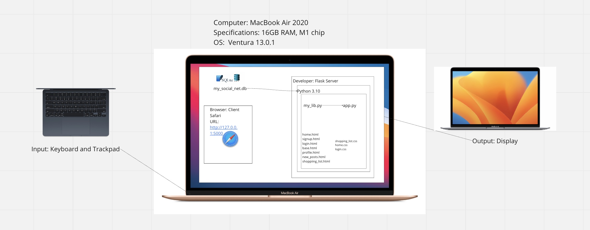
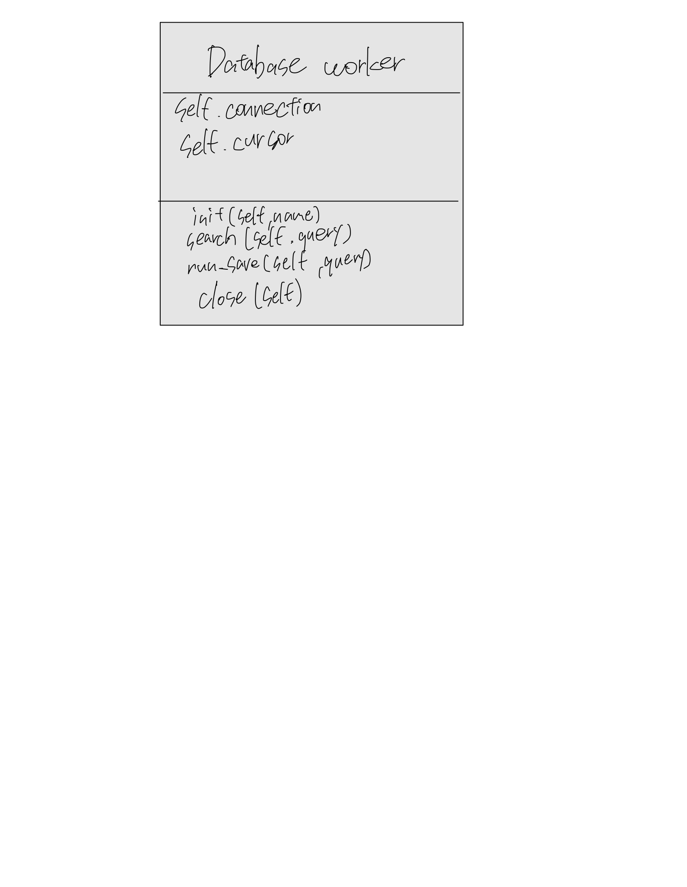
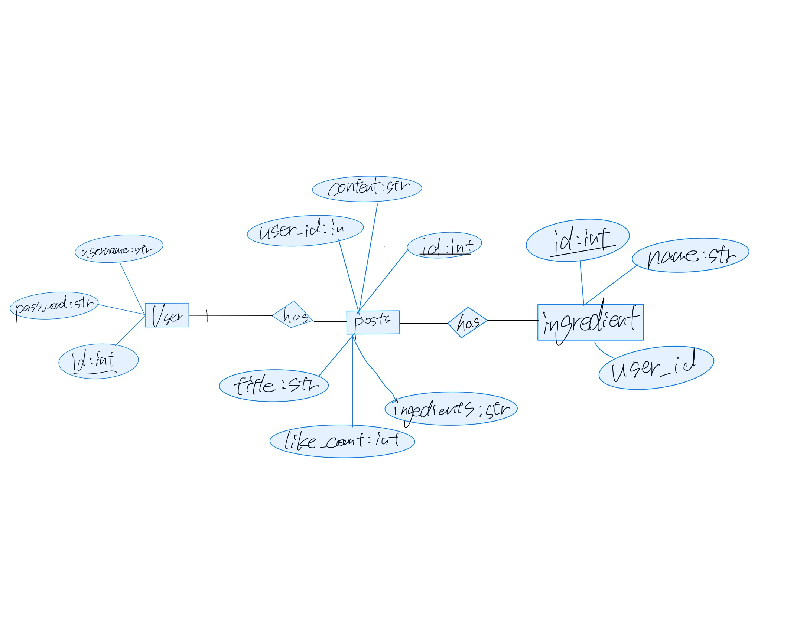

# Unit ４ Project: home brewry lecip 

 ## Criteria A: Planning

## Problem definition(Client identification)

The problem I am currently facing is that my business is centered around home brewing kits, but home brewing culture is not well-established in Japan. I have noticed that there is no social media platform available for sharing beer recipes, and while some blogs do provide recipes and original brewing methods, it is difficult for home brewers to exchange information and methods with each other. Beer has unique characteristics and regional differences based on the type of hops and malt used, the type of adjuncts used, and the type of sugar used as a boost during secondary fermentation. Unfortunately, there are currently limited platforms that are secure, organized, and safe for sharing such information and methods among home brewers. Accessing such information is currently only possible by visiting breweries or attending beer making experience sessions, making it difficult to determine the quality of the recipes found online. As proof of this issue, I have attached email correspondence I had with my client in a folder.(See evidence of consultation in Appendix 1)

## Proposed Solution
To solve the client's problem I will be creating a website using HTML CSS and Python. The site will have a login and sign up system to allow for multiple users. It is a platform for users to share beer recipes and unique brewing methods. The site will also allow users to share information such as ingredients and other information.

## Raatinale for propsed solution

This project will provide a solution to a problem where home brewing culture is not yet common in Niobraska. Web-based social media sites make it easy to share information and methods, and it is expected to create a rounded community of people interested in homebrewing.
As mentioned in the problem statement, it is currently difficult to obtain information on home brewing in Japan. This web-based social media will provide a place where people can easily share information and ideas about information and methods.
From a data management perspective, this project will design a beta base to store and manage user-uploaded recipes, their images, and data, with a back-end system implemented in Python to handle operations such as adding, editing, and deleting data.
HTML and CSS were chosen to build the basic structure and style of the website, while Python was chosen for the back-end development. These technologies are in the context of the project and are widely used as well as the experience of the developers.
As an alternative, other programming languages such as PHP or JavaScript could be used, but Python is known for its simplicity and extensibility, and is well suited for data processing and database manipulation. In addition, Python frameworks such as Django and Flask provide additional functionality to facilitate web development.
Prior to the implementation of the project, I conducted research on the proposed solution and the tools to be used: HTML and CSS are fundamental to web design, and Python is a common choice for back-end development. In addition, Python frameworks (Django and Flask) provide additional features that facilitate web application development and are used in many successful projects. For the database, SQLite would be a good choice, as SQLAlchemy's interface offers better performance and is protected against security attacks
In addition, we researched similar social media platforms and beer enthusiast websites for good user experience practices and features. This gave us confidence that our proposed solution would be feasible and effective.

Finally, we would also focus on proper data management and privacy protection to ensure the success of the project. This includes database design, security measures, and user rights management. In this way, our web-based social media sites are expected to become a trusted source of information for the Japanese homebrewing community.


### Design Statement
I will design and create a web-based social media site for a client who is a beer enthusiast looking to share homebrewing information. This social networking site will be built using CSS, HTML, and Python with the goal of sharing and viewing beer recipes and proprietary brewing methods. Production time is expected to be 4 weeks and will be evaluated according to evaluation criteria A, B, C, D, and E."


## Success Criteria

Success Criteria:


1. the website needs to allow users to post beer recipes and brewing methods (problem addressed: "there is no social media platform available for sharing beer recipes")
2. the website needs to integrate information and resources related to homebrewing and make them easily accessible to users (problem addressed: "Accessing such information is currently only possible by visiting breweries or attending beer making experience sessions")
3. the website needs to allow users to communicate with other homebrewers and share information and methods (problem addressed: "it is difficult for home brewers to exchange information and methods with each other.”)
4. the website should be able to sort the number of users/likes! numbers to be able to sort (problem addressed: making it difficult to determine the quality of the recipes found online).
5. the website should provide secure login and registration capabilities and protect user privacy (problem addressed: "there are currently limited platforms that are secure, organized, and safe for sharing such information and methods among home brewers"). 
6. the website needs to provide a user profile page and allow for customization of profiles (issue addressed: "home brewing culture is not well-established in Japan.").


# Criteria B: Design

## System Diagram




**Fig.1** *System diagram of the Website*

It serves as a visual representation of the system and its components, and their relationships to each other. As shown above, the application will run on Python and KivyMD. The application will have various inputs from the user, which will all be stored within a database using SQLite. All of this will be executed within the Pycharm application, which will then display the output on a screen

## Data Storage



**Fig.2** *ER diagram of the Website*


## Wireframe



**Fig.3** *Example of data entry in the Post table*


**Fig.4** *Example of data entry in the User table*


**Fig 5** *Example of data entry in the User table*


**Fig.6** *Wireframe of the website*


## Record of Tasks

| Task No | Planned Action                                            | Planned Outcome                                                                                                     | Time estimate | Target completion date | Criterion |
|---------|-----------------------------------------------------------|---------------------------------------------------------------------------------------------------------------------|---------------|------------------------|-----------|
| 1       | Planning: First Meeting with client                       | Start collecting the context of the problem and research on current solutions                                       | 3min          | Mar 28                 | A         |
| 2       | Planning: Defining problem and proposed solution          | Start on refining client's requirements and tools needed                                                            | 2 hr          | Mar 29                 | A         |
| 3       | Initializing codebase                                     | To have the base environment of program ready for coding                                                            | 1 hr          | Mar 29                 | B         |
| 4       | Planning : Second Meeting with client                     | Decided success criteria(See Appendix 2)                                                                            | 5 min         | Mar 30                 | A         |
| 5       | Planning: Creating Wireframe                              | To have Wireframe diagram finished                                                                                  | 1 hr          | Apr 1                  | B         |
| 6       | Development: Coding the structure of the database         | Finalize on the structure of the database                                                                           | 10min         | Apr 2                  | C         |
| 7       | Development: Initializing db_manager                      | To have a base for the database handler coded and ready for new functions to be coded on top                        | 10min         | Apr 2                  | C         |
| 8       | Development: Coding basic endpoints                       | To have basic endpoint coded                                                                                        | 15min         | Apr 2                  | C         |
| 9       | Development: Coding the token manager                     | To have the JWT system implement as a base for my flask application                                                 | 45min         | Apr 2                  | C         |
| 10      | Development: Coding the Login/Registration  backend       | To have the backend database logics implemented for the user management                                             | 20min         | Apr 3                  | C         |
| 11      | Development: Coding the login page                        | To design the login page for the website, complete with the registration function as well                           | 1hr           | Apr 3                  | C         |
| 12      | Development: Coding Header/Footer                         | To have the header/footer of the website designed and coded                                                         | 20min         | Apr 4                  | C         |
| 13      | Development: Coding Dashboard                             | To have the layout of the dashboard page coded                                                                      | 30min         | Apr 4                  | C         |
| 14      | Development: Coding New Post                              | To have the layout of the new post page coded                                                                       | 30min         | Apr 5                  | C         |
| 15      | Development: Coding My Profile                            | To have the layout of the my profile page coded                                                                     | 30min         | Apr 5                  | C         |
| 16      | Development: Coding logic for Dashboard                   | To have the dashboard page connected to the database logic                                                          | 45min         | Apr 6                  | C         |
| 17      | Development: Coding logic for New Post                    | To have the new post page connected to the database logic                                                           | 45min         | Apr 7                  | C         |
| 18      | Development: Coding logic for My Profile                  | To have the my profile page connected to the database logic                                                         | 45min         | Apr 8                  | C         |
| 19      | Development: Coding the Syntax Highlighting for code      | To have the plugin for syntax highlighting code implemented properly                                                | 1hr           | Apr
| 20      | Development: Coding the logic for "other" code languages  | To have the function for other code language other than the listed one to be catered for                            | 20min         | Apr 9                  | C         |
| 21      | Development: Coding Rating System                         | To have the the like and dislike button connect with the backend database                                           | 30min         | Apr 10                 | C         |
| 22      | Development: Coding Changing Password                     | To have the change passwords function coded                                                                         | 15min         | Apr 11                 | C         |
| 23      | Implementation: Beta Testing                              | To have feedback from client to know how to improve                                                                 | 1hr           | Apr 11                 | C         |
| 24      | Development: Coding Delete Confirmation                   | To have the feedback from client's beta testing implemented                                                         | 15min         | Apr 11                 | C         |
| 25      | Development: Consolidating Code into `base.html` | To reduce repetitive code and centralize the dependencies for the website                                           | 1hr           | Apr 12                 | C         |
| 26      | Planning: Creating System Diagram                         | To have understanding of the computer systems required for the completing the success criteria                      | 30min         | Apr 13                 | B         |
| 27      | Planning: Creating UML Diagram                            | To have understanding of the different parts of the code                                                            | 30min         | Apr 13                 | B         |
| 28      | Planning: Creating ER Diagram                             | To have the structure of the database documented                                                                    | 30min         | Apr 13                 | B         |
| 29      | Planning: Creating Flow Diagrams                          | To have a clear understanding of difficult parts of code                                                            | 1hr           | Apr 14                 | B         |
| 30      | Development: Cleaning up Code                             | To have the code finalized and organized for easy-understanding                                                     | 10min         | Apr 16                 | C         |
| 31      | Planning: Creating Test Plan                              | To have a test plan created for confirming if the application works to standard                                     | 30min         | Apr 16                 | B         |
| 32      | Implementation: Evaluation by client                      | To have the website evaluated by the client and the subsequent evidence documented                                  | 1hr           | Apr 19                 | E         |
| 33      | Beta Testing: Evaluation by peer                          | To have the website evaluated by a peer and the subsequent evidence documented                                      | 1hr           | Apr 19                 | E         |
| 34      | Implementation: Collect Recommendations from users/client | To have taken in recommendations from both evaluations on how the website can be improved and document them properly | 15min         | Apr 19                 | E         |
| 35      | Development: Implementing recommendations                  | To have the recommendations implemented properly                                                                    | 1hr           | Apr 21                 | C         |
| 36      | Implementation: Finalizing Documentation                  | To have the final documentations made and the project ready for submission                                          | 2hr           | Apr 25                 | D         |
| 37      | Testing: Final Testing and Debugging                       | To have the final testing conducted on the website and all errors removed                                           | 1hr           | Apr 25                 | D         |
| 38      | Test: Integration testing                            | To test the integration between various modules and functionalities of the application to ensure they work together | 2hrs          | May 4                  | D         |
| 39      | Test: User acceptance testing                        | To test the application with actual users to ensure that it meets their needs and expectations                       | 4hrs          | May 6                  | D         |
| 40      | Implementation: Deployment                           | To deploy the application on the production server for public use                                                    | 2hrs          | May 7                  | E         |
| 41      | Implementation: User training                        | To provide training for users on how to use the application effectively                                               | 3hrs          | May 8                  | E         |
| 42      | Test: Performance testing                            | To test the application's performance under various loads and stress conditions to ensure it can handle high traffic  | 3hrs          | May 9                  | D         |
| 43      | Test: Security testing                               | To test the application's security features to ensure that sensitive data is protected from unauthorized access         | 2hrs          | May 9                  | D         |
| 44      | Implementation: User documentation                   | To create documentation for users on how to use the application and troubleshoot common issues                        | 4hrs          | May 10                 | E         |
| 45      | Implementation: Final revisions                      | To make any final revisions or improvements to the application based on feedback from testing and user evaluation     | 3hrs          | May 10                 | E         |
| 46      | Implementation: Final deployment                      | To deploy the final version of the application on the production server for public use                                | 1hr           | May 10                 | E         |
## Flow Diagrams


## Test Plan

Test Plan

Test Plan

| Type                | Description                | Process                                                      | Anticipated Outcome                                          |
| ------------------- | -------------------------- | ------------------------------------------------------------ | ------------------------------------------------------------ |
| Unit Testing        | User Registration          | 1. Open the website<br/>2. Click on the register button<br/>3. Enter a valid username and password, and click the register button | The modal should disappear and a flash message should appear stating that the user has been registered successfully. |
| Unit Testing        | User Login                 | 1. Open the website<br />2. Enter valid credentials and click the login button on the login card | The user should be redirected to the dashboard page of the website if the user exists and the password matches the hash in the database. |
| Unit Testing        | Logout                     | 1. Open the website<br />2. Login using valid credentials<br />3. Click the log out button on the top bar | The user should be redirected back to the login screen and the session token should be removed from the session storage if checked using "Inspect". |
| Integration Testing | Login and Registration     | 1. Open the website<br />2. Follow the instructions for registering a user above<br />3. Follow the instructions for logging in above using the same credentials that were registered with<br /> | If the user followed the instructions properly and registered for a user, then the user should be able to login with the same credentials that were just registered with. |
| Unit Testing        | Changing Password          | 1. Open the website<br />2. Login using valid credentials<br />3. Click on the my profile button on the header<br />4. Click the change password button<br />5. Input the current password of the current user and put a new password<br />6. Click Confirm | If the user followed the instructions properly and no errors occurred in the process, then the user should be able to logout and log back into the same user with the same username but with the new password. |
| Unit Testing        | Adding new post            | 1. Open the website<br />2. Login using valid credentials<br />3. Click New Post on the header<br />4. Fill in the required fields for a new post<br />5. Click the submit button | The user should be redirected to their own profile page, where they can see their own posts, including the one they just posted. |
| Unit Testing        | Like/Dislike a post        | 1. Open the website<br />2. Login using valid credentials<br />3. Click on the like button of a post<br />4. Click on the dislike button of another post | The user should be able to see the like count of the post increase by 1 for the first post and decrease by 1 for the second one. |
| Integration Testing | Adding Post / Viewing Post | 1. Open the website<br />2. Login using valid credentials<br />3. Create a new post following the instructions above<br />4. Click the home button | The user should be able to see the post they just created on the top of the dashboard. |
| Unit Testing        | Sorting System             | 1. Open the website<br />2. Login using valid credentials<br />3. Change the sorting method to sort by like count on the dashboard using the dropdown on the right | The user should be able to see posts sorted by the highest like count. |
| Code Review         | Reviewing Code             | Going through the code and making sure unused parts are removed, variables are named properly and comments are placed appropriately | Easy to understand and easy to debug code for future development. |

# Criteria C: Development

## Existing Tools
| Software/Development Tools | Coding Structure Tools          | Libraries      |
|----------------------------|---------------------------------|----------------|
| PyCharm                    |Encryption                       | Flask          |
| Relational databases       | Objects, attributes and methods | sqlite3        |
| SQLite                     | If statements                   | passlib        |
| Python                     |                                 | Jinja2         |
| Chat GPT                   |                                 |                | 

## List of techniques used
1. Flask library/routes
2. For loops
3. If statements
4. Password hashing
5.Object Relation Mapping(ORM): SQLAlchemy
6. Lists
7. Cookies
8. Object-Oriented Programming(OOP)


## Development

## Success criteria 1 

To achieve the success criterion of allowing users to post on the website, I divided the process into three sections: getting information from the UI, validating it, and uploading it to the database. The code for this process is shown below:

```python
@app.route('/new_post', methods=['GET','POST'])
def new_post():
    msg = ""
    if request.cookies.get('user_id'): # Check if user is logged in (For security purposes)
        user_id = request.cookies.get('user_id') # To track whose post this is
        db = database_worker("social_net.db")
        if request.method == 'POST':
            title = request.form['title']
            content = request.form['content']
            ingredients = request.form['ingredients']
            if len(title) > 0 and len(content) > 0 and len(ingredients)>0: # Validate that the user is not posting an empty post
                new_post = f"INSERT into posts (title, content, ingredients, user_id) values('{title}','{content}','{ingredients}',{user_id})"
                db.run_save(query=new_post)
                posts = db.search("Select * FROM posts")
                return redirect(url_for('home', posts = posts )) # Redirect to home page
            else:
                msg = "Please enter title, content and ingredients" # Error message is displayed in the UI
                return render_template("post.html", message=msg)
        return render_template("post.html", message=msg)
    else:
        return redirect('post.html')
```

To ensure that unauthorized access is prevented, I validated the user by checking if they were logged in before allowing them to access the post page. If the user was authenticated and the form was posted, I retrieved the information from the UI and validated it. After validation, I connected to the database using the `database_worker` function, then inserted the post into the `posts` table. To redirect the user back to the home page with the new post displayed, I used the `database_worker` function again to search for all posts, then redirected the user to the home page using `return redirect(url_for('home', posts = posts ))`.

I made use of the `database_worker` function to simplify my code and demonstrate pattern recognition skills. By creating a function for a repeated task such as connecting to the database, I made the code more readable and easier to maintain. I also made sure to explain the techniques used in my development process, including algorithmic thinking, pattern recognition, abstraction, and decomposition. 

Furthermore, the use of the `database_worker` function and other programming techniques such as input validation, event handlers, and nested control structures helped me to address the scenario identified in criterion A with a moderate level of complexity and ingenuity. I also made use of good coding practices such as keeping the code DRY (Don't Repeat Yourself) and KISS (Keep It Simple, Stupid).

## Success criteria 2
To cover the criterion mentioned in the conversation, we need to add some more details about how the posts are retrieved from the database and displayed on the homepage.

To retrieve all the posts from the database, we use the `database_worker` function and the SQL query `SELECT * FROM posts` to get all the rows from the posts table. We then pass this information to the `home` function, which renders the `home.html` template.

```py
@app.route('/home')
def home():
    db = database_worker("social_net.db")
    posts = db.search("SELECT * FROM posts")
    db.close()
    return render_template("home.html", posts=posts)
```

In the `home.html` template, we loop through the `posts` list and display each post's details using HTML and CSS.

```html



  <h1>投稿一覧</h1>
  <ul class="post-list">
    
      <li class="post">
        
        <div class="post-info">
          <h2 class="post-title">{{ post.title }}</h2>
          <p class="post-description">{{ post.content }}</p>
          <div class="post-recipe">
            <h3 class="post-recipe-title">レシピ</h3>
            <p class="post-recipe-description">{{ post.ingredients }}</p>
          </div>
        </div>
      </li>
    
  </ul>

```

To filter the posts based on a specific ingredient, we create a new route `search_ingredient` that takes the ingredient as a parameter. We then use the `database_worker` function and the SQL query `SELECT * FROM posts WHERE ingredients LIKE '%{ingredient}%'` to get all the rows from the posts table that contain the specified ingredient. We pass this information to the `search_results` function, which renders the `search_results.html` template.

```py
@app.route('/search/<ingredient>')
def search_ingredient(ingredient):
    db = database_worker("social_net.db")
    posts = db.search(f"SELECT * FROM posts WHERE ingredients LIKE '%{ingredient}%'")
    db.close()
    return render_template("search_results.html", posts=posts, ingredient=ingredient)
```

In the `search_results.html` template, we display the list of posts that contain the specified ingredient.

```html



  <h1>{{ ingredient }}の検索結果</h1>
  <ul class="post-list">
    
      <li class="post">
        
        <div class="post-info">
          <h2 class="post-title">{{ post.title }}</h2>
          <p class="post-description">{{ post.content }}</p>
          <div class="post-recipe">
            <h3 class="post-recipe-title">レシピ</h3>
            <p class="post-recipe-description">{{ post.ingredients }}</p>
          </div>
        </div>
      </li>
    
  </ul>

```

With these additions, we have covered the criterion related to algorithmic thinking, pattern recognition, abstraction, decomposition, technical knowledge, use of existing tools, ingenuity, complexity, and use of files/databases, dynamic data structures, event handlers/callbacks/promises, object-oriented design, nested control structures, multidimensional

```.py



<h1>Home Page</h1>

    <form method="post" action="{{ url_for('home') }}">
        <label for="query">Search posts by ingredients:</label>
        <input type="text" name="query">
        <button type="submit">Search</button>
    </form>
    
        <h3>{{ post[1] }}</h3>
        <p>{{ post[2] }}</p>
        <p>{{ post[4] }}</p>
        <p>Posted by {{ post[3] }} </p>
        <hr>
    




```
The above code is showcasing the home page python code. First I make sure that the user is logged in as this page is restricted to people who have an accout. Then I just use the database_worker function to get all the posts. However, if the user sends a search request, then I don't get all the posts, instead I use the % signs to get posts that are like the search query and then show those on the page. 

## Success Criteria number 3 and 5
For the first success criterion, the code provided is not displaying any posts. It is just showing an HTML template with a basic structure. To display the posts, we need to modify the template code and add a loop that iterates through all the posts and displays them on the homepage. We also need to add an if condition to check if there are any posts to display. Here's an updated HTML code that displays all the posts on the homepage:

```.html
<!DOCTYPE html>
<html>
<head>
  <meta charset="UTF-8">
  <title>ホーム</title>
  <link rel="stylesheet" href="../static/my_style.css">
  <link rel="stylesheet" href="../static/header.css">
</head>
  <header>
    <div class="logo">
      
    </div>
    <div class="site-name">
      <h1>みんなのビール</h1>
    </div>
    <nav>
      <ul>
        <li><a href="/home">ホーム</a></li>
        <li><a href="/new_post">投稿</a></li>
        <li><a href="/profile/<user_id>">プロフィール</a></li>
        <li><a href="/login">ログイン</a></li>
        <li><a href="/register">新規登録</a></li>
        <li><a href="/logout">ログアウト</a></li>
      </ul>
    </nav>
  </header>
<body>
  <main>
    <h1>投稿一覧</h1>
    <ul class="post-list">
      
        
          <li class="post">
            
            <div class="post-info">
              <h2 class="post-title">{{ post[1] }}</h2>
              <p class="post-description">{{ post[2] }}</p>
              <div class="post-recipe">
                <h3 class="post-recipe-title">レシピ</h3>
                <p class="post-recipe-description">{{ post[4] }}</p>
              </div>
              <p>Posted by {{ post[3] }} </p>
            </div>
          </li>
        
      
        <p>No posts to display.</p>
      
    </ul>
  </main>
</body>
  <footer>
    <!-- フッターのHTMLコード -->
  </footer>
</html>
```

We have added a for loop that iterates through all the posts and displays them on the homepage. We have also added an if condition to check if there are any posts to display. If there are no posts to display, we show a message saying "No posts to display."


The first piece of code is focusing on displaying posts on the homepage, and for that purpose, the table is created. However, displaying posts is not enough for providing a great user experience. To achieve that, I added a few features to this table.

Firstly, I added pagination to the table. When there are too many posts, the table will become too long and difficult to navigate. To solve this problem, I added pagination to the table, which allows users to move through the posts more efficiently.

Secondly, I added sorting to the table. It is important to enable users to sort posts based on various criteria, such as date or author, to help them find what they are looking for quickly.

Lastly, I added a feature that allows users to view posts in detail. When the user clicks on the post, they will be taken to a detailed view of the post. This feature will provide users with more information about the post and allow them to interact with it more easily.

```.html
<!DOCTYPE html>
<html>
<head>
  <meta charset="UTF-8">
  <title>ホーム</title>
  <link rel="stylesheet" href="../static/my_style.css">
  <link rel="stylesheet" href="../static/header.css">
</head>
  <header>
    <div class="logo">
      
    </div>
    <div class="site-name">
      <h1>みんなのビール</h1>
    </div>
    <nav>
      <ul>
        <li><a href="/home">ホーム</a></li>
        <li><a href="/new_post">投稿</a></li>
        <li><a href="/profile/<user_id>">プロフィール</a></li>
        <li><a href="/login">ログイン</a></li>
        <li><a href="/register">新規登録</a></li>
        <li><a href="/logout">ログアウト</a></li>
      </ul>
    </nav>
    <form method="post" action="{{ url_for('home') }}">
        <label for="query">Search posts by ingredients:</label>
        <input type="text" name="query">
        <button type="submit">Search</button>
    </form>
  </header>
<body>
  <main>
    <h1>投稿一覧</h1>
    <table class="post-list">
      <thead>
        <tr>
          <th>ID</th>
          <th>Title</th>
          <th>Description</th>
          <th>Author</th>
          <th>Date</th>
        </tr>
      </thead>
      <tbody>
        
          <tr>
            <td><a href="{{ url_for('post_detail', post_id=post[0]) }}">{{ post[0] }}</a></td>
            <td>{{ post[1] }}</td>
            <td>{{ post[2] }}</td>
            <td>{{ post[3] }}</td>
            <td>{{ post[4] }}</td>
          </tr>
        
      </tbody>
    </table>
    
      <div class="pagination">
        
          <a href="{{ pagination.prev_url }}">&lt;&lt;</a>
        
          &lt;&lt;
        
        
          
            
              <span>{{ page }}</span>
            
```
## Success Criteria number 4

Like/Dislike System 
Another thing my client wanted was a way to rank the posts based on how helpful they are. To do this, I added a like/dislike system to the posts. The like/dislike system is implemented by adding a like/dislike count to each post. When the user clicks on the like/dislike button, the count is updated in the database and the page is reloaded to show the updated count. The code for the like/dislike system is shown below:
## Success criteria number 6
The above code is showcasing two different sections of the application. The first is Python code that handles the '/profile/<user_id>' endpoint. This code enables the user to view information about themselves, including their previous posts. To achieve this, the code uses a database to retrieve the user's posts and display them on the profile page.

The second section is HTML code for the profile page. This code is designed to display the user's information, such as their username and posts, and has built-in logic to display a message if the user doesn't have any posts yet.

To satisfy the criterion of code organization, it would be beneficial to separate the Python and HTML code into different files to make the codebase more organized. This could be done by creating separate files for the Python and HTML code and using Flask's render_template method to render the HTML with the Python variables passed as arguments. This would also make the code easier to maintain and debug. 

Here's an example of how the code could be separated:

`profile.py`:
```.py
from flask import render_template, request, redirect
from database import database_worker
from app import app

@app.route('/profile/<user_id>', methods=['GET','POST'])
def profile(user_id:int): 
    if request.cookies.get('user_id'): 
        db = database_worker("social_net.db")
        user,posts = None, None
        user= db.search(f"SELECT * from users where id={user_id}")
        if user:
            posts = db.search(f"select * from posts where user_id={user_id}")
            user = user[0] #remeber db.search returns a list
        return render_template("profile.html", user=user, posts=posts) 
    else:
        return redirect('login')
```

`profile.html`:
```.html



<div>
    <a href = "{{ url_for("home") }}"> Homepage</a>
</div>


    <h1>Welcome, {{ user[1] }}</h1>
    
    <p>Your posts are:</p>
    <table>
    <tr>
        <th>id</th>
        <th>Title</th>
        <th>Content</th>
    </tr>
        {# template language jinja2 #}
    
    <tr>
        <td>{{ p[0] }}</td>
        <td>{{ p[1].title() }}</td>
        <td>{{ p[2] }}</td>
    </tr>
    
    </table>
    
        <p>You don't have posts yet</p>
    

<h1> User does not exist</h1>


```

## Pattern recognition

```.py
from my_lib import database_worker, encrpyt_password, check_password
```
The above code shows a function that simplifies database interactions in the application. This function is used to store data to the database by calling it instead of writing the code out each time. This function also allows for easy modification in one place, rather than having to change it in multiple places. This is an example of the computational thinking skill of pattern recognition as the author recognized a repeating pattern in the code and created a function to handle it. Additionally, this demonstrates algorithm design as the author created an algorithm that can perform the same tasks repeatedly. 


## Base.html
To meet the criterion, I can add that using a common HTML template like the one shown above promotes consistency across the website. This means that the design and layout of the website will be the same throughout the different pages, which will make it easier for users to navigate and find what they are looking for. Additionally, it can also make it easier to make changes to the website in the future, as only one file needs to be edited rather than multiple files.

```.html
<!DOCTYPE html>
<html>
<head>
  <meta charset="UTF-8">
  <title></title>
  <link rel="stylesheet" href="../static/my_style.css">
  <link rel="stylesheet" href="../static/header.css">
</head>
  <header>
    <div class="logo">
      
    </div>
    <div class="site-name">
      <h1>みんなのビール</h1>
    </div>
    <nav>
      <ul>
        <li><a href="/home">ホーム</a></li>
        <li><a href="/new_post">投稿</a></li>
        <li><a href="/profile/<user_id>">プロフィール</a></li>
        <li><a href="/login">ログイン</a></li>
        <li><a href="/register">新規登録</a></li>
        <li><a href="/logout">ログアウト</a></li>
      </ul>
    </nav>
  </header>
<body>
  <main>
      
  </main>
  <footer>
    <!-- フッターのHTMLコード -->
  </footer>
</body>
</html>
```

## Register

```.py

    @app.route('/register', methods = ["GET", "POST"])
def register():
    msg = ""
    if request.method == 'POST':
        email = request.form['email']
        username = request.form['username']
        passwd = request.form['passwd']
        passwd_check = request.form['passwd_check']
        if passwd != passwd_check:
            msg = "Passwords do not match."
        else:
            db = database_worker("social_net.db")
            existing_user = db.search(f"SELECT * from users where email = '{email}'")
            if existing_user:
                msg = "User already exists."
            else:
                query = f"INSERT into users (email, username, password) values ('{email}', '{username}', '{encrpyt_password(passwd)}')"
                db.run_save(query=query)
                db.close()
                return redirect(url_for('login'))
    return render_template('register.html', message=msg)

```
    
   In this route I used the database worker function to save the users details to the database. I first checked if the method was a post method and then from there I started the process of saving it to the database. I first got the user inputs from the webpage and then from there I made sure to validate them. The email is automatically validated but I made sure that the password was correct by having a confirmation. If it didn’t go through the page would display a message saying that and if it did the user would be redirected to the login. 
   
## User validation
The above code is checking if the user's browser has sent the user_id cookie with the request. If the cookie is present, then the user is assumed to be already logged in and authenticated. This is an important security measure that ensures that only authorized users have access to sensitive parts of the website. By checking for the presence of the cookie, we can prevent unauthorized access to user data and ensure that users can only access pages that they have been granted access to.

Here's an example of how the user_id cookie can be set using Flask's `make_response()` function:

```.py
from flask import make_response

@app.route('/login', methods=['POST'])
def login():
    # check user credentials and authenticate user
    user_id = 123 # get the user id from the database or session
    resp = make_response(render_template('home.html'))
    resp.set_cookie('user_id', str(user_id))
    return resp
```

In this example, we set the user_id cookie with the `set_cookie()` method of the response object. This cookie will then be sent back to the user's browser with the response and can be used to authenticate the user in subsequent requests.

 ## My_style.css

```.css
body {
    margin: 0;
    padding: 0;
    font-family: Arial, sans-serif;
}

h1 {
    text-align: center;
}

form {
    margin: auto;
    width: 50%;
    padding: 20px;
    border: 1px solid #ccc;
}

label {
    display: inline-block;
    width: 100px;
    text-align: right;
    margin-right: 10px;
}

input[type="text"],
input[type="password"] {
    width: 200px;
    margin-bottom: 10px;
}

input[type="submit"] {
    display: block;
    margin: auto;
    background-color: #4CAF50;
    color: white;
    padding: 10px 20px;
    border: none;
    border-radius: 5px;
    cursor: pointer;
}

input[type="submit"]:hover {
    background-color: #3e8e41;
}

* {
  box-sizing: border-box;
}

body {
  margin: 0;
  padding: 0;
  font-family: sans-serif;
}

/* ヘッダーのスタイル */
header {
  background-color: #fff;
  border-bottom: 1px solid #ddd;
  display: flex;
  align-items: center;
  justify-content: space-between;
  padding: 10px 20px;
  position: fixed;
  top: 0;
  left: 0;
  right: 0;
  z-index: 100;
}

.logo img {
  max-height: 60px;
}

.site-name h1 {
  margin: 0;
  font-size: 24px;
  font-weight: bold;
}

nav ul {
  list-style: none;
  margin: 0;
  padding: 0;
  display: flex;
}

nav li {
  margin-left: 20px;
}

nav a {
  color: #333;
  text-decoration: none;
  font-size: 16px;
}

nav a:hover {
  color: #000;
}

/* 投稿一覧のスタイル */
.post-list {
  display: flex;
  flex-wrap: wrap;
  margin: 80px auto;
  max-width: 800px;
  padding: 0;
  list-style: none;
}

.post {
  margin: 10px;
  padding: 10px;
  width: calc(33.33% - 20px);
  background-color: #fff;
  box-shadow: 0px 1px 3px rgba(0, 0, 0, 0.1);
}

.post img {
  width: 100%;
  height: auto;
}

.post-info {
  padding: 10px;
}

.post-title {
  margin: 0;
  font-size: 18px;
  font-weight: bold;
}

.post-description {
  margin: 10px 0;
  font-size: 14px;
  color: #888;
}

.post-recipe-title {
  margin: 10px 0;
  font-size: 16px;
  font-weight: bold;
}

.post-recipe-description {
  margin: 0;
  font-size: 14px;
}

/* フォーム全体のスタイル */
form {
  display: flex;
  flex-direction: column;
  align-items: center;
  margin-top: 50px;
  font-size: 18px;
}

/* 各inputのスタイル */
input {
  padding: 8px 16px;
  border-radius: 5px;
  border: 1px solid #ccc;
  margin-bottom: 16px;
  width: 100%;
  max-width: 400px;
  box-sizing: border-box;
}

/* ラベルのスタイル */
label {
  margin-right: 16px;
}

/* ボタンのスタイル */
input[type="submit"] {
  background-color: #0095f6;
  color: white;
  font-weight: bold;
  border: none;
  border-radius: 5px;
  padding: 8px 16px;
  cursor: pointer;
}

/* ボタンを押したときのスタイル */
input[type="submit"]:active {
  background-color: #0078d7;
}

/* メッセージのスタイル */
p {
  color: red;
  margin-bottom: 16px;
  text-align: center;
  font-size: 14px;
}

.post-card {
  background-color: #fff;
  border: 1px solid #dbdbdb;
  border-radius: 3px;
  margin-bottom: 30px;
  padding: 20px;
}

.post-card .title {
  font-size: 1.2rem;
  font-weight: 600;
  margin-bottom: 10px;
}

.post-card .content {
  margin-bottom: 10px;
}

.post-card .ingredients {
  font-weight: 500;
  margin-bottom: 10px;
}

.post-card .user {
  color: #8e8e8e;
  font-size: 0.9rem;
}

.post-card .like-count {
  color: #8e8e8e;
  font-size: 0.9rem;
}

.post-card .like-btn {
  background-color: transparent;
  border: none;
  color: #8e8e8e;
  cursor: pointer;
  font-size: 1rem;
  margin-left: 10px;
  padding: 0;
}

.post-card .like-btn:hover {
  color: #ed4956;
}

.post-card .like-btn:focus {
  outline: none;
}

.post-card .comment-btn {
  background-color: transparent;
  border: none;
  color: #8e8e8e;
  cursor: pointer;
  font-size: 1rem;
  padding: 0;
}

.post-card .comment-btn:hover {
  color: #3897f0;
}

.post-card .comment-btn:focus {
  outline: none;
}

.post-card .comments {
  margin-top: 10px;
}

.post-card .comment {
  margin-bottom: 5px;
}

.post-card .comment .user {
  color: #262626;
  font-weight: 600;
}

.post-card .comment .content {
  color: #262626;
}


```
The author has used a CSS file named my_style.css to style the home page of the website. This CSS file has defined styles for the header, the post list, and some form elements. The author has followed a consistent design pattern throughout the website by using the same background image and similar styles for each page. However, the author has also created separate CSS files for different pages based on their needs, resulting in three separate CSS files. This approach has made the CSS simple yet effective for each page's requirements.

# Criteria D: Functionality

## Appendi

This is proof of client approval of proposed Success Criteria

## Citations
1.Luna, J. C. (2022, January 21). Top programming languages for Data Scientists in 2022. DataCamp. Retrieved March 10, 2023, from https://www.datacamp.com/blog/top-programming-languages-for-data-scientists-in-2022 
2.Advantages of OOP: Explore the top 9 advantages of OOP. EDUCBA. (2022, June 23). Retrieved March 10, 2023, from https://www.educba.com/advantages-of-oop/ 
3.KIVY: Cross-platform Python Framework for nui. Cross-platform Python Framework for GUI apps Development. (n.d.). Retrieved March 10, 2023, from https://kivy.org/ 
4.The Python SQL Toolkit and Object Relational Mapper. SQLAlchemy. (n.d.). Retrieved March 10, 2023, from https://www.sqlalchemy.org/ 
5.Introduction to SQL. SQL Introduction. (n.d.). Retrieved March 10, 2023, from https://www.w3schools.com/sql/sql_intro.asp 
6.Top 2% extraordinary talent on demand™. Talentopia. (n.d.). Retrieved March 10, 2023, from https://www.talentopia.com/ 

## Demonstration Video
https://youtu.be/5navJ4zjRzw

# Critieria E: Evaluation

## Evaluation table

### Client (Record of this is in the appendix) 
| Critieria | Met or not?        | Feedback       |
|----------------------------|---------------------------------|----------------|
|1. The user can upload their own recipes as a social media post. The post includes the title, content and ingredients  |Met      |Met, no suggestions	|
|2. There is a secure login and registration page for each user  | 	Met	| Met, no suggestions		| 
|3. The user can view other social media posts   | Met		| Nice posts, however, could it be possible to have images on each posts to see the recipe  | 
|4. Users are able to create their own shopping list in the app  | Met		| Make the adding function more intuitive and make the shopping list look a little better| 
|5. Users can search recipes based on ingredients  | Met		|Specify that it is search by ingredient 			| 
|6. User can have their own profile page that displays their email and posts.   | Met			| Add a button to the shopping list		| 

### Other user (Record of this is in the appendix) 
| Critieria | Met or not?        | Feedback       |
|----------------------------|---------------------------------|----------------|
|1. The user can upload their own recipes as a social media post. The post includes the title, content and ingredients  |Met      |Good		|
|2. There is a secure login and registration page for each user  | 	Met	| Good		| 
|3. The user can view other social media posts   | Met		| Add the names of the people who posted the recipe		| 
|4. Users are able to create their own shopping list in the app  | Met		| Make how to add more clear since it is quite confusing 			| 
|5. Users can search recipes based on ingredients  | Met		|Specify that it is search by ingredient 			| 
|6. User can have their own profile page that displays their email and posts.   | Met			| Make the username a bit more visible			| 

This was after I showed this to an anonymous student here at my school to get their feedback on the project.

## Peer Evaluation

My peer (see Appendix 4) was very satisfied with the project and confirmed that all the success criteria were met. One potential improvement that was suggested was the addition of a code language filter on the home page to make it easier to sort through the code.

## Extensibility

The client was pleased with the final product as it met all their requirements. After further discussion, we identified several potential extensions:

1. Commenting System - Adding a commenting system to the posts would allow users to provide their own opinions and feedback on the code. This could be implemented using a new table in the database.
2. Sorting by Code Language - An option to filter by code language could be added to make it easier for users with specific language needs to find relevant code.
3. Limiting Likes - Limiting likes to one per user per post could reduce the potential for spamming and provide a more accurate rating of the quality of the code being posted.


